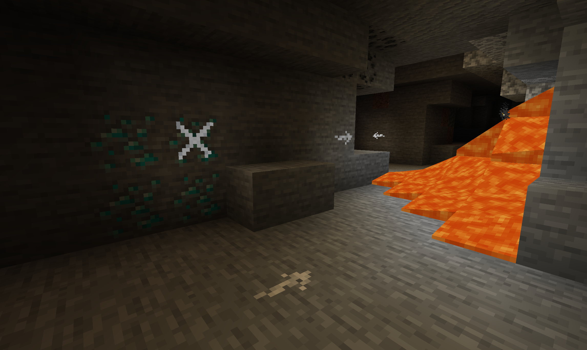

# Chalk
https://www.curseforge.com/minecraft/mc-mods/chalk-fabric

Fabric port of the Minecraft mod [Chalk](https://github.com/mortuusars/Chalk) by mortuusars with some additions and 1.17 adjustments. Thank you very much for creating the original Forge version and the permission to port Chalk to fabric!

### Adds two simple types of chalk to aid you on your mining journeys. Never lose your way again.

### Adds:
- Chalk: Crafted shapeless with 2 Calcite
- Glow Chalk: Crafted shapeless with 2 Calcite and a Glow Ink Sac

With chalk, you are able to mark the surface of every full block. 
Hitting the corner of a block creates an arrow pointing in that direction, hitting the center creates an X.
Marks from Glow Chalk can be seen in total darkness, perfect for caving action!
